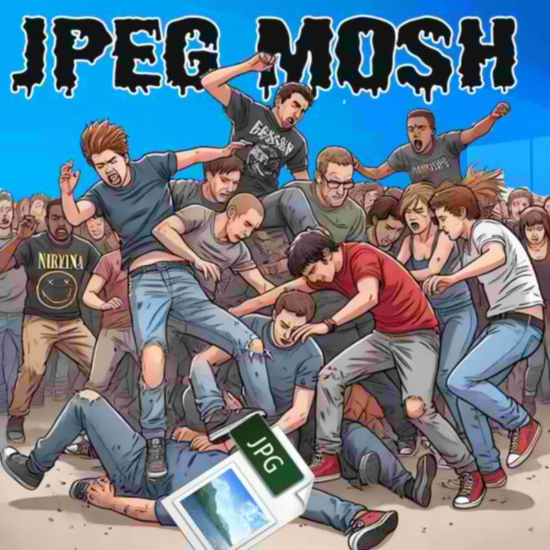

# node-jpeg-mosher

Pure JS CLI that mildly corrupts JPEGs for a moshing-like effect; e.g. introduces creative distortions into the image data.

All Credit goes to [knobs-dials](https://github.com/knobs-dials), who wrote the original in python ([https://github.com/knobs-dials/jpeg-mosh/](https://github.com/knobs-dials/jpeg-mosh/)), and did a lot of interesting research. It's available live at [https://mosh.scarfboy.com/](https://github.com/knobs-dials/jpeg-mosh/).

The test.jpg is from https://commons.wikimedia.org/wiki/File:Jpeg_thumb_artifacts_test.jpg

## Requirements

- Node.js v14+ (uses native ES modules and promises)
- The ability to tolerate bad software

## Installation

1. Clone this repository or download the script.
2. Run `npm install` to install the necessary dependencies.

## Usage

### Options

- `--output`, `-o`: Path to save the moshed JPEG file. (Default: `moshed_image.jpg`)
- `--number`, `-n`: Number of files to mosh. (Default: `1`)
- `--iterations`, `-i`: Number of iterations to run the moshing process. (Default: `3`)

### Example

Mosh multiple JPEG files:

```bash
node index.js input.jpg -n 3 -o moshed_output.jpg
```

This command applies the mosh effect to the `input.jpg` file, saves the output as `moshed_output.jpg`, and processes the image three times (`moshed_output-1.jpg, ...`). The original file is not modified.